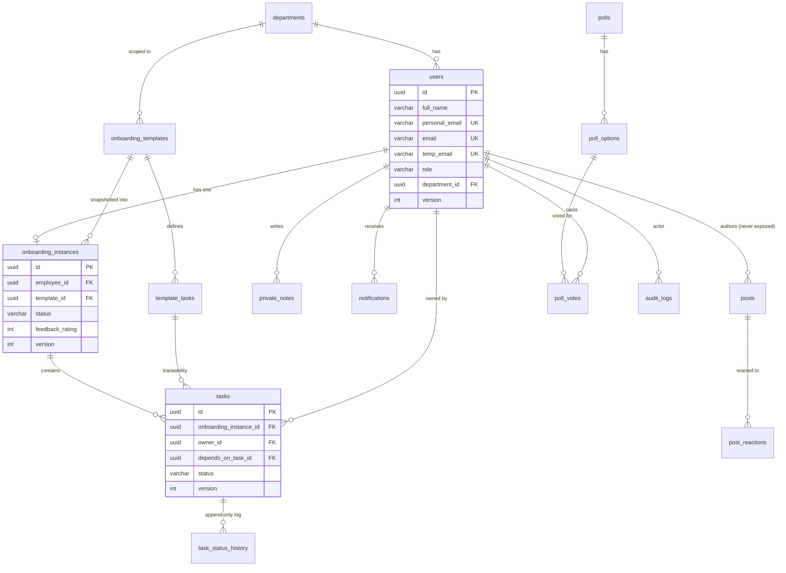

# Employee Onboarding Tracker

A full-stack employee onboarding platform: templated checklists, role-based
task ownership, in-app notifications, private notes, community, analytics,
and audit logging — built as a 5-day portfolio project.

**Stack:** React + TypeScript (Vite, Tailwind) · NestJS + TypeScript · PostgreSQL (Neon) · Redis (Upstash) · Supabase Storage · plain SQL migrations (custom runner) · Recharts

---

## Setup

### Prerequisites
- Node.js 20+
- A Postgres database (this project targets [Neon](https://neon.tech))
- A Redis instance (this project targets [Upstash](https://upstash.com))
- A [Supabase](https://supabase.com) project with a Storage bucket, for file uploads

### Backend

```bash
cd backend
npm install
cp .env.example .env   # fill in DATABASE_URL, REDIS_URL, JWT secrets, SUPABASE_*
npm run migrate:up     # applies every migration in migrations/, in order
npm run seed:minimal   # creates the first Super Admin account
npm run start:dev
```

The dev mail transport uses [Ethereal Email](https://ethereal.email) — every
send logs a preview link to the console, no real inbox required.

### Frontend

```bash
cd frontend
npm install
cp .env.example .env   # set VITE_API_BASE_URL to your backend URL
npm run dev
```

### Migrations

Plain paired SQL files, no ORM or migration framework:

```
migrations/<timestamp>_<name>.up.sql
migrations/<timestamp>_<name>.down.sql
```

`npm run migrate:up` applies every `.up.sql` not yet recorded in
`schema_migrations`, in timestamp order, each inside its own transaction.
`npm run migrate:down` rolls back the single most recent migration.

---

## Architecture

```
┌─────────────────────────────┐        ┌──────────────────────────────┐
│   React SPA (Vite)          │  HTTPS │   NestJS API                 │
│   - AuthContext (JWT)       │◄──────►│   - AppAuthGuard (JWT+roles) │
│   - axios client            │        │   - one module per domain    │
│   - React Router            │        └──────────────┬───────────────┘
└──────────────────────────────┘                       │
                                                        │ pg
                          ┌─────────────────────────────┼─────────────────┐
                          │                              ▼                 │
                   ┌──────────────┐              ┌───────────────┐   ┌───────────┐
                   │  Redis        │              │  Postgres      │   │ Supabase  │
                   │  refresh &    │              │  (Neon)        │   │ Storage   │
                   │  blacklist    │              │                │   │ (uploads) │
                   └──────────────┘              └───────────────┘   └───────────┘
```

Every NestJS module follows the same shape: `*.controller.ts` (routes +
`@Roles`/`@Permissions`), `*.service.ts` (business logic + SQL), `*.module.ts`
(DI wiring), `dto/*.ts` (class-validator input shapes). Guards read the JWT,
resolve role → permission via a static map (`rbac/permission-map.ts`), and
attach `request.user`. Ownership (`currentUser.id === resource.owner`) is
always checked in the service layer, separately from role permissions.

### Key design decisions

- **Effective task state is computed, never stored.** A task's raw `status`
  column and its dependency's status are combined on every read
  (`TaskStateService`) into `WAITING | AVAILABLE | IN_PROGRESS | COMPLETED`.
  The database, the API, and the UI can never disagree.
- **Template edits are immutable for in-flight onboardings.** Creating an
  onboarding instance snapshots the template's tasks into real rows; editing
  the template afterward never touches instances already created.
- **Task status transitions run inside `SERIALIZABLE` transactions** with
  retry-on-40001, plus a `version` column checked in the same `UPDATE`, so two
  concurrent completions of the same task can't both win. Verified in
  `backend/scripts/concurrency-check.ts`.
- **A single `NotificationService.create()`** is the only insertion path for
  notifications — every triggering module calls through it, so swapping in a
  queue (BullMQ) later touches one file, not every caller.
- **Author identity on community posts is never exposed**, not even to
  moderators — moderation is HIDE/RESTORE only, audited via
  `moderated_by`/`moderated_at` on the row itself, never a hard delete.
- **Every audit-relevant action funnels through one `AuditService.log()`**,
  recording exactly 7 curated event types — a searchable, append-only trail.

---

## Entity-Relationship Diagram



---

## Role & Permission Matrix

Every user is fundamentally an **Employee** — roles add capability on top,
they never take away the baseline (own onboarding, own notes, own tasks).

| Capability | Employee | HR | Admin | Super Admin |
|---|:---:|:---:|:---:|:---:|
| View/complete own onboarding tasks | ✅ | ✅ | ✅ | ✅ |
| Manage own private notes | ✅ | ✅ | ✅ | ✅ |
| Create employees | — | ✅ | — | ✅ |
| Manage onboarding templates | — | ✅ | ✅ | ✅ |
| Reassign / view all tasks | — | ✅ | ✅ | ✅ |
| Manage FAQs, resources, entitlements, content gallery | — | ✅ | ✅ | ✅ |
| Moderate community posts | — | ✅ | ✅ | ✅ |
| View reports & feedback aggregate | — | ✅ | ✅ | ✅ |
| CSV export (own data) | ✅ | ✅ | ✅ | ✅ |
| CSV export (all data) | — | ✅ | ✅ | ✅ |
| Change a user's role | — | — | — | ✅ |
| Full audit log | — | — | scoped | ✅ |
| Read (never edit) any employee's private notes | — | — | — | ✅ (audited) |

Enforced in two layers: `@Roles(...)` / `@Permissions(...)` guards on
controllers (see `rbac/permission-map.ts` for the full static map), and
ownership checks (`currentUser.id === resource.owner`) inside services for
anything scoped to "own" data.

---

## API surface

~20 modules, grouped by domain — auth, users, departments, onboarding
(templates/instances/tasks/reading), notes, entitlements, uploads,
notifications, resources, faq, company, feedback, community (posts/polls),
exports, content-gallery, dashboard, reports, audit. Every controller
mirrors its module name as the route prefix (e.g. `entitlements.controller.ts`
→ `/entitlements`). See each `*.controller.ts` for the exact routes and role
gates — that file is the source of truth over any doc.

---

## Known limitations (honest, not hidden)

- **Optimistic locking (`version` column) is fully enforced on `tasks`**
  (verified under concurrent load), but not yet on every `onboarding_instances`
  and `users` write path — some updates there use a plain `WHERE id = $1`
  rather than a version-checked conditional update.
- **Verified email-change flow** (`request-email-change` /
  `confirm-email-change`, for *post-transform* email changes) is designed but
  not implemented — only the one-time temp→official transform exists.
  The Profile page reflects this honestly rather than exposing a broken flow.
- **CSV export "HR-managed scope"** is simplified to "all staff see all data"
  — there's no per-HR department boundary in this codebase yet.
- **"Overdue tasks"** has no due-date concept in the schema, so it uses a
  documented heuristic (required, incomplete, instance started 7+ days ago)
  rather than a real deadline.
- Notifications are synchronous inserts, not queued — a natural BullMQ
  candidate later, since the single `NotificationService.create()` choke
  point means adopting a queue touches one file.

---

## Testing this yourself

```bash
# Backend build + typecheck
cd backend && npm run build

# Frontend build + typecheck
cd frontend && npm run build

# Concurrency guarantee (needs a running backend + a real task id)
npx ts-node backend/scripts/concurrency-check.ts <email> <password> <taskId>
```
